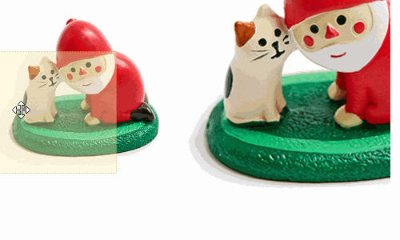

## zoomImg.js


	
	
A JavaScript utility for zooming image on mouse hover. 
	
	
### Features
- No dependencies.
- Without jQuery.
- Displays its magnified image beside the thumbnail image while the mouse is hovering.
	
	
### To use
Insert its CSS at the `<head>` section.
```
	<link rel="stylesheet" type="text/css" href="css/zoomImg.css">
```
	
	
To initialize it, add the below codes at the `<body>` section.  
The parameter is the `id` of image div, where designs for image zooming.
```
	<script type="text/javascript" src="js/zoomImg.js"></script>
	<script type="text/javascript">
		var zoomIt = new setZoom({
			container: "preview"
		});

```	
	
### Description	
This JavaScript utility consists of three main parts, `_getDom` getting DOM objects, `_setStyles` setting the custom styles and `_setEvent` setting trigger events.

In order to display its magnified image correctly, we need to calculate its X and Y positions.
When the mouse is hovering, the X of zooming lens is clientX `-` the half width of the lens frame, vice versa, the Y of zooming lens is clientY `-` the half height of the lens frame. 

```javascript
	var imgZoomX = mouseX - previewX - (imgZoomWidth/2);
	var imgZoomY = mouseY - previewY - (imgZoomHeight/2);
```


The zooming effect is only triggered inside the thumbnail image area, and the lens cannot exceed the thumbnail image area.

```javascript
	if(imgZoomX <= 0){
		imgZoomX =0 ;
	}
	else if(imgZoomX >= previewWidth - imgZoomWidth){
		imgZoomX = previewWidth - imgZoomWidth;
	}
			
	if(imgZoomY <= 0){
		imgZoomY = 0;
	}
	else if (imgZoomY >= previewHeight - imgZoomHeight){
		imgZoomY = previewHeight - imgZoomHeight;
	}
	self.imgZoom.style.left = imgZoomX + "px";
	self.imgZoom.style.top = imgZoomY + "px";
```

While zooming, the ratio of zoom is based on the scale between the magnified image and the thumbnail image.
```javascript
	self.bigimg.style.left = -imgZoomX * (bigimgWidth/previewWidth) + "px";
	self.bigimg.style.top = -imgZoomY * (bigimgHeight/previewHeight) + "px";
```
  
### Demo
[Check it in CodePen](https://codepen.io/miaoT/pen/LoOWpW "zoomImg.js")	
	